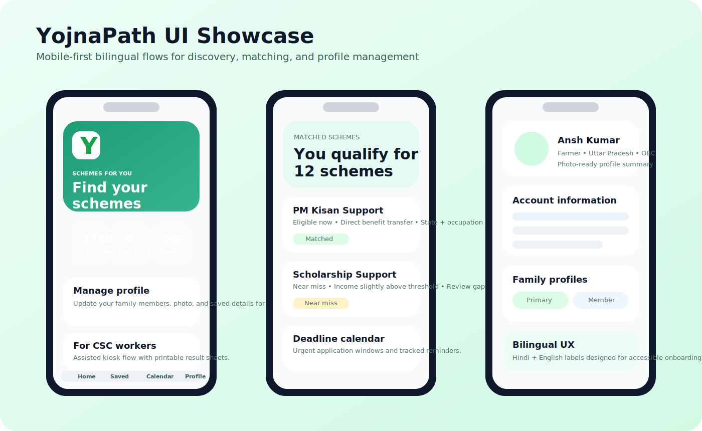
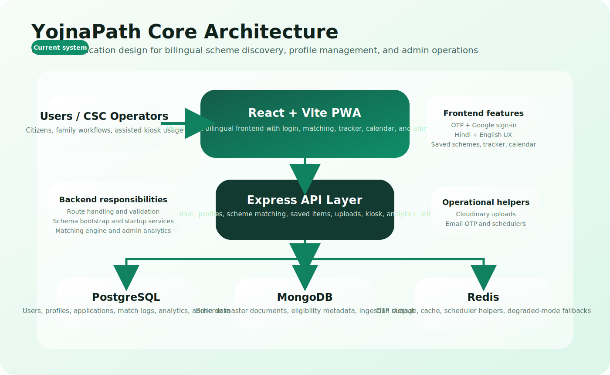
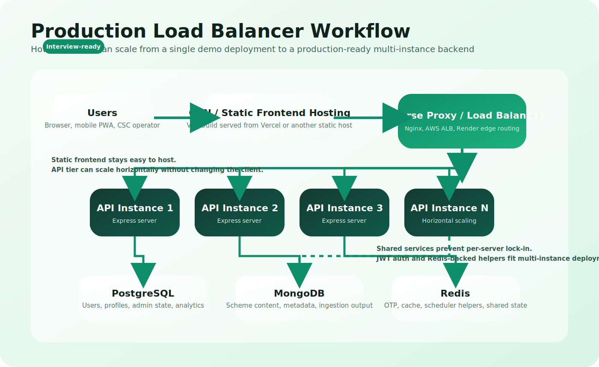
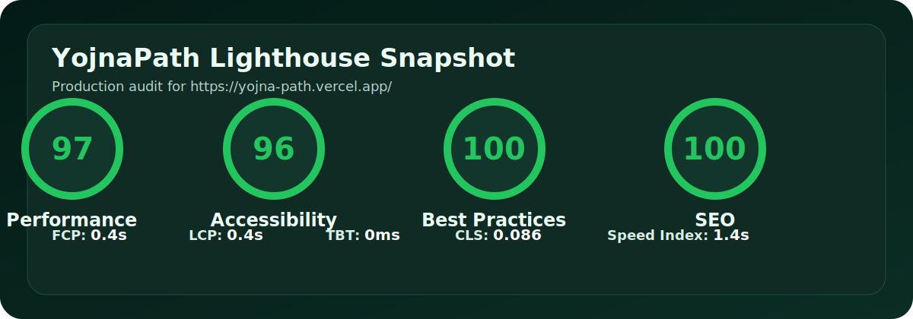

<p align="center">
  
</p>

<h1 align="center">YojnaPath</h1>

<p align="center">
  A full-stack government scheme discovery platform for matching users and families with relevant welfare benefits.
</p>

<p align="center">
  <a href="https://yojna-path.vercel.app/"><strong>Live Demo</strong></a> &middot;
  <a href="#lighthouse-snapshot">Lighthouse</a> &middot;
  <a href="#screenshots">Screenshots</a> &middot;
  <a href="#tech-stack">Tech Stack</a>
</p>

<p align="center">
  <strong>50+ real users onboarded</strong> &middot;
  <strong>Bilingual Hindi + English UX</strong> &middot;
  <strong>OTP + Google sign-in</strong> &middot;
  <strong>Admin analytics + kiosk workflows</strong>
</p>

## Live Demo

- Production app: `https://yojna-path.vercel.app/`

## Product Highlights

| Area | What YojnaPath delivers |
| --- | --- |
| User onboarding | OTP login, Google sign-in, profile creation, family member management, and photo-based identity setup |
| Scheme discovery | Rules-based scheme matching, near-miss analysis, saved schemes, and personalized results |
| Actionability | Deadline calendar, application tracking, reminder flows, and printable kiosk result sheets |
| Accessibility | Mobile-first UI, Hindi-English support, installable PWA behavior, and low-friction guided flows |
| Operations | Admin dashboard, analytics, reports, scheme moderation, exports, and runtime-safe schema evolution |

## Screenshots

<p align="center">
  
</p>

Featured screens shown in the preview above:

- `Home`: bilingual mobile-first landing experience with install prompt, category discovery, and recent matches
- `Profile`: multi-profile account management, eligibility details, and assisted voice/data entry flows
- `Results`: matched schemes, near-miss explanations, and category-based filtering
- `Admin Dashboard`: operational analytics, system health, user growth, and scheme monitoring

## Overview

YojnaPath is a full-stack platform built for Indian users to discover, understand, and track government welfare schemes. It supports account registration, family profile creation, scheme matching, near-miss analysis, deadline discovery, kiosk-assisted usage, and a complete admin console for operations and analytics.

The repository is split into:

- `frontend/`: React + Vite client
- `backend/`: Express API with PostgreSQL, MongoDB, Redis-backed helpers, Cloudinary uploads, and admin tooling

## Interview Talking Points

- YojnaPath uses a separated frontend and backend architecture, which makes deployment and scaling cleaner than a tightly coupled monolith.
- The React and Vite PWA focuses on mobile-first access, bilingual UX, and low-friction onboarding for real users and kiosk operators.
- The Express API centralizes authentication, profile management, scheme matching, admin analytics, and operational workflows.
- PostgreSQL, MongoDB, and Redis each serve a distinct role, which is a good example of choosing storage based on access patterns instead of forcing everything into one database.
- The production scaling workflow shows how the backend could run behind a load balancer with multiple API instances and shared services.
- A realistic engineering caveat is that some rate limiting still uses in-memory state, so Redis-backed shared throttling would be the next step for true multi-instance consistency.

## Architecture

<p align="center">
  
</p>

## Production Scaling Workflow

This project does not require a load balancer for local development or small demo traffic, but it is designed in a way that can scale behind one for production-style deployments.

<p align="center">
  
</p>

### How the workflow works

1. The frontend is served as static assets through a CDN or frontend host.
2. API traffic goes through a reverse proxy or load balancer such as Nginx, AWS ALB, or Render edge routing.
3. The load balancer distributes requests across multiple Express API instances.
4. All API instances connect to the same PostgreSQL, MongoDB, and Redis services.
5. Because authentication is token-based and shared services hold app state, requests do not need to stay on a single server instance.

### Why this is a good interview talking point

- It shows you understand the difference between building an MVP and designing for scale.
- The backend already enables `trust proxy`, which is important when Express runs behind a proxy or load balancer.
- Redis-backed helpers for OTP and caching fit well in a multi-instance deployment because shared cache/state is better than per-server state.
- The React frontend and Express backend are already separated, which makes horizontal API scaling easier.

### Honest engineering note

If you discuss this in an interview, frame it as a production-ready scaling approach, not as a feature already fully deployed in this repository.

One important limitation in the current code is that some rate limiting logic uses in-memory buckets inside the Node process. That works on a single backend instance, but for strict consistency behind a load balancer it should be moved to Redis or another shared store.

## End-to-End Flow

1. Users sign in with phone OTP, email OTP, or Google.
2. They create their own profile or add family-member profiles with demographic and eligibility details.
3. The matching engine evaluates profile attributes against scheme eligibility criteria and returns exact matches plus near misses.
4. Users save schemes, track applications, review deadlines, and revisit recommendations through the PWA.
5. Admins monitor usage, scheme quality, analytics, reports, and kiosk activity through the operations console.

## Highlights

- OTP-based authentication with phone and email flows
- Optional Google sign-in support
- Family profile creation and management
- Scheme matching and near-miss analysis
- Saved schemes and application tracking
- Deadline calendar and urgent scheme surfacing
- Kiosk mode for operator-assisted usage
- Hindi-first scheme explanation flow powered by Gemini
- Admin dashboard with users, schemes, analytics, reports, and settings
- Runtime schema bootstrap for safer deployment on evolving databases

## Lighthouse Snapshot

Latest production audit for `https://yojna-path.vercel.app/`:

<p align="center">
  
</p>

| Category | Score |
| --- | ---: |
| Performance | 97 |
| Accessibility | 96 |
| Best Practices | 100 |
| SEO | 100 |

Core metrics from the same run:

- First Contentful Paint: `0.4s`
- Largest Contentful Paint: `0.4s`
- Total Blocking Time: `0ms`
- Cumulative Layout Shift: `0.086`
- Speed Index: `1.4s`

These scores reflect the mobile-focused optimization work in this repository, including image sizing, SEO hardening, PWA tuning, deferred service worker registration, and startup bundle reduction.

## Tech Stack

### Frontend

- React 18
- Vite
- React Router
- TanStack Query
- TanStack Table
- Recharts
- i18next / react-i18next
- Tailwind CSS
- PWA support via `vite-plugin-pwa`

### Backend

- Node.js
- Express
- PostgreSQL for users, profiles, admin data, logs, and relational app state
- MongoDB for scheme content
- Redis for OTP, caching, and scheduler support
- Cloudinary for photo uploads
- Nodemailer for email OTP
- Puppeteer and seed utilities for scheme ingestion

## Project Structure

```text
YojnaPath/
|-- backend/
|   |-- config/
|   |-- controllers/
|   |-- db/
|   |-- engine/
|   |-- middleware/
|   |-- models/
|   |-- routes/
|   |-- scripts/
|   |-- seeds/
|   |-- services/
|   `-- index.js
|-- frontend/
|   |-- public/
|   |-- src/
|   |   |-- components/
|   |   |-- data/
|   |   |-- i18n/
|   |   |-- lib/
|   |   |-- pages/
|   |   `-- utils/
|   `-- vite.config.js
`-- README.md
```

## Core User Flows

### Public and user experience

- `Login` / `Verify OTP`: phone or email login
- `Register`: complete account registration with photo
- `Onboard` / `Profile`: build personal or family profiles
- `Results`: get matched schemes and near misses
- `Saved`: bookmark schemes
- `Tracker`: track applications and statuses
- `Calendar`: browse scheme deadlines
- `Scheme Detail`: view detailed scheme information and explanation
- `Kiosk`: assisted flow for kiosk/operator usage

### Admin experience

- Dashboard
- Analytics
- Reports
- Users list and user detail pages
- Scheme list, add/edit flow, review actions, exports
- Settings

## Backend Route Overview

### Public routes

- `GET /api/health`
- `GET /api/impact`

### Auth

- `POST /api/auth/login`
- `POST /api/auth/verify`
- `POST /api/auth/google`
- `GET /api/auth/me`
- `POST /api/auth/register`

### Profiles

- `GET /api/profile`
- `GET /api/profile/members`
- `POST /api/profile`
- `DELETE /api/profile/:profileId`

### Schemes

- `POST /api/schemes/match`
- `POST /api/schemes/:id/explain`
- `POST /api/schemes/:id/report`
- `GET /api/schemes/all`
- `GET /api/schemes/urgent`
- `GET /api/schemes/top`
- `GET /api/schemes/top/:userType`
- `GET /api/schemes/:id`

### Saved and applications

- `GET /api/saved`
- `POST /api/saved/:schemeId`
- `DELETE /api/saved/:schemeId`
- `GET /api/applications`
- `POST /api/applications`
- `PATCH /api/applications/:schemeId`

### Uploads

- `POST /api/upload/photo`

### Kiosk

- `POST /api/kiosk/login`
- `POST /api/kiosk/match`
- `POST /api/kiosk/pdf-download`

### Admin

- `POST /api/admin/auth/login`
- `GET /api/admin/auth/me`
- dashboard, stats, activity, funnel
- analytics overview / funnel / near-miss / schemes / photo / kiosk
- reports and exports
- user list, user detail, live matches, delete
- scheme list, edit, review, bulk update, export
- settings

## Data Architecture

The app uses both PostgreSQL and MongoDB.

### PostgreSQL is used for

- users
- admins
- profiles
- saved schemes
- applications
- match logs
- funnel events
- kiosk events
- scheme review/report metadata
- admin settings and analytics support tables

### MongoDB is used for

- scheme master documents
- rich scheme content, eligibility, metadata, and seed output

## Local Development

### 1. Clone the repository

```bash
git clone <your-repo-url>
cd YojnaPath
```

### 2. Install dependencies

Backend:

```bash
cd backend
npm install
```

Frontend:

```bash
cd ../frontend
npm install
```

### 3. Configure environment variables

Create:

- `backend/.env`
- `frontend/.env`

Suggested backend variables:

```env
PORT=4000
NODE_ENV=development

DATABASE_URL=postgres://...
PGSSLMODE=require
MONGODB_URI=mongodb+srv://...
REDIS_URL=redis://...

JWT_SECRET=your-user-jwt-secret
ADMIN_JWT_SECRET=your-admin-jwt-secret

CLOUDINARY_CLOUD_NAME=...
CLOUDINARY_API_KEY=...
CLOUDINARY_API_SECRET=...

CORS_ORIGIN=http://localhost:5173
FRONTEND_URL=http://localhost:5173

GOOGLE_CLIENT_ID=...
GEMINI_API_KEY=...
GEMINI_MODEL=gemini-2.5-flash-lite

DEMO_OTP_ENABLED=true
DEMO_OTP_CODE=123456
DEMO_OTP_PHONES=
SMS_OTP_ENABLED=false
EXPOSE_OTP_IN_RESPONSE=true

KIOSK_CODES=
KIOSK_DEMO_ID=KIOSK_DEMO_1
KIOSK_DEMO_CODE=DEMO1234

URGENT_DEADLINE_LOOKAHEAD_DAYS=7
DEADLINE_TRACKER_HOUR_IST=6
URL_HEALTH_WEEKLY_LIMIT=100
URL_HEALTH_RATE_LIMIT_MS=200
```

Suggested frontend variables:

```env
VITE_API_BASE_URL=http://localhost:4000
VITE_GOOGLE_CLIENT_ID=...
```

Notes:

- `VITE_API_BASE_URL` and `VITE_API_URL` are both supported in the frontend.
- Some backend features work in degraded mode if Redis or MongoDB is unavailable, but full functionality expects both.
- Cloudinary is required for production photo upload flows.

### 4. Start the backend

```bash
cd backend
npm run dev
```

### 5. Start the frontend

```bash
cd frontend
npm run dev
```

Frontend runs on Vite's default dev port and talks to the backend through `VITE_API_BASE_URL`.

## Build Commands

Frontend production build:

```bash
cd frontend
npm run build
```

Backend production start:

```bash
cd backend
npm start
```

## Tests

Backend tests:

```bash
cd backend
npm test
```

The backend includes tests around admin services, schema bootstrap, profile behavior, and related service logic.

## Database Bootstrap and Migrations

The backend uses a hybrid startup migration approach:

- `backend/db/schema.sql` initializes core tables
- runtime schema bootstrap runs on server startup
- service-level migration helpers add missing columns and tables safely for evolving production deployments

Recent compatibility work in this project ensures older production schemas can continue running while newer fields such as profile typing and admin analytics structures are introduced.

## Seed and Maintenance Scripts

Backend scripts:

- `npm run create:admin`
- `npm run seed:schemes`
- `npm run seed:myscheme`
- `npm run seed:datagov`
- `npm run scrape:myscheme`
- `npm run check:urls`
- `npm run audit:scheme-urls`
- `npm run repair:scheme-urls`

These scripts support admin creation, scheme ingestion, URL checking, and content repair workflows.

## Deployment Notes

### Frontend

- Deploy `frontend/` as a static site
- Set `VITE_API_BASE_URL` to the backend base URL
- If using Google login, also set `VITE_GOOGLE_CLIENT_ID`

### Backend

- Deploy `backend/` as a Node service
- Ensure PostgreSQL, MongoDB, and optional Redis are reachable
- Set Cloudinary credentials for upload support
- Configure CORS with your frontend domain
- On startup, the backend attempts schema bootstrap automatically

### Render/Vercel style deployment

- Frontend can be hosted on Vercel
- Backend can be hosted on Render
- Set `FRONTEND_URL` and `CORS_ORIGIN` correctly on the backend
- If PostgreSQL uses SSL, set `PGSSLMODE=require`

## Known Operational Notes

- Cloudinary images may trigger browser privacy warnings like "Tracking Prevention blocked access to storage" on some browsers. This is usually a browser privacy message, not an application crash.
- Admin image-heavy pages were optimized to avoid duplicate hidden-layout rendering and reduce repeated third-party image requests.
- Admin payloads now distinguish account registration state from profile readiness for scheme matching.

## Recommended README Add-ons

If you want to make this README even stronger later, the next good additions would be:

- project screenshots
- architecture diagram
- sample `.env.example` files
- sample admin login/bootstrap instructions
- scheme ingestion workflow documentation
- API request/response examples
- deployment diagram showing CDN, load balancer, and shared data services

## License

No license file is currently included in this repository. Add one if you want to open-source or formally share the project.
